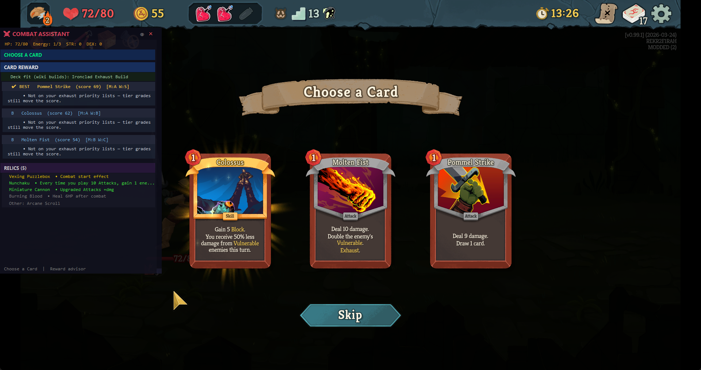

## BoberInSpire – Slay the Spire 2 Combat Assistant


BoberInSpire is a **hybrid C# + Python assistant** for Slay the Spire 2.  
A custom C# mod exports the current combat / merchant state to JSON, and a Python overlay analyzes it and shows real‑time information in a separate, semi‑transparent window.

### Main features

- **Real-time combat state** – mod exports hand, energy, block, and enemy data to JSON.
- **Damage and block summary** – overlay shows net damage and per-enemy incoming damage.
- **Relic summaries** – combat-relevant relic effects shown in a compact list.
- **Semi-transparent overlay** – always-on-top window with ghost (click-through) mode (F9).
- **Card reward advisor** – on the post-combat **Choose a Card** screen, ranks the three offered cards using **[Mobalytics](https://mobalytics.gg/slay-the-spire-2/tier-lists/cards) S/A/B/C/D tier lists** (per character) **combined** with deck/archetype heuristics from local build guides. The overlay shows **BEST**, tier letter, blended score, and a short reason (e.g. `Mobalytics B-tier; …`).

#### Card pick advisor (screenshot)



The mod writes reward options to `%APPDATA%\SlayTheSpire2\bober_reward_state.json`; the overlay reads them and updates the **CHOOSE A CARD / CARD REWARD** section. Tier data lives in `data/tier_lists/mobalytics_cards.json` (see `data/tier_lists/README.md` to refresh from Mobalytics).

---

### Data source & acknowledgments

Card and relic data used by the overlay comes from **[Spire Codex](https://spire-codex.com/)**, the Slay the Spire 2 database and API built from decompiled game data. Many thanks to the Spire Codex project for making this data available.

- **Website:** [https://spire-codex.com/](https://spire-codex.com/)
- **Repository:** [https://github.com/ptrlrd/spire-codex](https://github.com/ptrlrd/spire-codex)

**Card reward tiers** are based on Mobalytics’ [Slay the Spire 2 card tier list](https://mobalytics.gg/slay-the-spire-2/tier-lists/cards) (Early Access / preliminary list — update the JSON when their rankings change).

## Requirements

- **Slay the Spire 2** (Steam, default path used in the mod):
  - `C:\Program Files (x86)\Steam\steamapps\common\Slay the Spire 2`
- **.NET 9 SDK** (for building the C# mod).
- **Godot 4.x Mono** (only needed for the automatic `.pck` build step; if you don’t have it, you can still copy the built DLL manually).
- **Python 3.11** (recommended; the repo uses `py -3.11` in commands).
- **Pip packages**: `watchdog`, `keyboard` (see `requirements.txt`).

The mod loader (GUMM) must already be installed in your STS2 directory, and **modding must be enabled**.

---

## Quick reference (BoberInSpire)

All commands are from the **project root** (`BoberInSpire`).

| What you want | Command |
|---------------|---------|
| **Build the C# mod** (local dev; close STS2 first) | `dotnet build STS2Mods\sts2_example_mod\ExampleMod.csproj -c Debug` |
| **Run the overlay** (after `pip install -r requirements.txt`) | `py -3.11 -m python_app.main` |
| **Build release package** (fills `dist\BoberInSpire\`) | `.\build.bat` |
| **Create installer** (needs Inno Setup; run after `.\build.bat`) | `iscc installer.iss` |

The installer is created as **`dist\BoberInSpire_Setup_1.0.0.exe`**.

---

## Run locally (development)

1. **Build the mod** (with STS2 **closed**):

   ```bat
   dotnet build STS2Mods\sts2_example_mod\ExampleMod.csproj -c Debug
   ```

   This builds **BoberInSpire.dll** (and the `.pck`) and copies them to your STS2 `mods\BoberInSpire\` folder. The project file is still `ExampleMod.csproj`; the mod name and output DLL are **BoberInSpire**.

2. **Install Python deps** (once):

   ```bat
   py -3.11 -m pip install -r requirements.txt
   ```

3. **Run the overlay**:

   ```bat
   py -3.11 -m python_app.main
   ```

4. Start STS2 via GUMM, enable **BoberInSpire** in the mod list, and enter combat. The overlay watches `%APPDATA%\SlayTheSpire2\bober_combat_state.json` (combat) and **`bober_reward_state.json`** (card rewards) and updates in real time.

> If the mod build fails with "file is being used by another process", **close STS2** and run the build again.

---

## Release package (installer)

To produce a single installer that deploys both the overlay and the mod:

1. **Build the distribution** (with STS2 closed):

   ```bat
   .\build.bat
   ```

   (In PowerShell use `.\build.bat`; in cmd you can use `build.bat`.)

   This builds the C# mod in **Release**, exports the `.pck` (if Godot is on `PATH` or set via `GODOT_EXE`), and fills **`dist\BoberInSpire\`** with the overlay app, data, and mod files.

2. **Compile the installer** (requires [Inno Setup](https://jrsoftware.org/isinfo.php)):

   - **Option A – Inno Setup on PATH:**  
     Add `C:\Program Files (x86)\Inno Setup 6` to your **Path** (Environment Variables), then in a new terminal:

     ```bat
     iscc installer.iss
     ```

   - **Option B – Without PATH** (PowerShell, from project root):

     ```powershell
     & "C:\Program Files (x86)\Inno Setup 6\ISCC.exe" installer.iss
     ```

   Output: **`dist\BoberInSpire_Setup_1.0.0.exe`**.

3. **Run the installer** – choose install path, optional desktop shortcut, and optionally copy mod to STS2. After install, run **BoberInSpire Overlay** from the Start Menu (or desktop). Python 3.11 must be on `PATH` for the overlay to run.

---

## Optional: custom game path

If STS2 is not in the default location, create **`STS2Mods\sts2_example_mod\local.props`**:

```xml
<Project>
  <PropertyGroup>
    <STS2GamePath>C:\Path\To\Your\Slay the Spire 2</STS2GamePath>
    <GodotExePath>C:\Path\To\Godot_mono.exe</GodotExePath>
  </PropertyGroup>
</Project>
```

---

## Overlay controls

- **Drag window** – click and drag the custom title bar.
- **Resize** – drag the small grip in the bottom-right corner.
- **Close** – click the **X** in the title bar.
- **Ghost mode (click-through)** – click the **eye** icon or press **F9**; clicks pass through to the game. Press F9 again to return to interactive mode.
